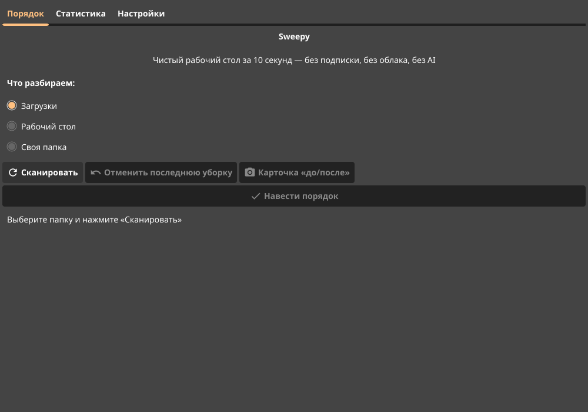

# Sweepy

Органайзер рабочего стола и папки «Загрузки» в один клик.
**$0.99 один раз — без подписки, без облака, без аккаунта, без AI, без телеметрии.**

Стек: **Go 1.22+ / Fyne v2.6** (GUI) + **fsnotify** (фоновый сторож папок).
Один бинарник, без рантайм-зависимостей. Windows / Linux / macOS.
Sweepy **никогда ничего не удаляет** — только перемещает файлы по подпапкам,
с предпросмотром, журналом и полной отменой в один клик.



## Возможности (v1.0)

- **Один клик**: разбор «Загрузок», рабочего стола или любой своей папки
  по 8 готовым категориям (Документы, Изображения, Скриншоты, Архивы,
  Аудио, Видео, Программы, Прочее)
- **Предпросмотр** «что куда поедет» до применения изменений
- **Полная отмена**: журнал операций, возврат всех файлов одним кликом;
  частично выполненная уборка тоже откатывается
- **Безопасность**: никогда не удаляет и не перезаписывает; коллизии имён
  разрешаются суффиксом `(1)`, `(2)`; скрытые/системные файлы и ярлыки
  не трогаются
- **Статистика**: «разобрано файлов», «наведено порядка (ГБ)», серия чистых
  дней, история по дням
- **Фоновый сторож**: раскладывает новые файлы через 5 секунд после
  завершения скачивания (дебаунс записи)
- **Автозапуск** вместе с системой (Windows / Linux / macOS)
- **Системный трей**: закрытие окна сворачивает Sweepy в трей
- **Карточка «до/после»**: PNG с результатом уборки — готово к публикации
- **Два языка интерфейса**: русский и английский
- **Настройки**: редактор категорий (расширения + слова в имени)

## Структура

```
sweepy/
├── main.go                  — точка входа
├── FyneApp.toml             — метаданные для fyne package (сторы)
├── Makefile                 — build / test / vet / dist-*
├── internal/
│   ├── core/                — ядро (не знает об UI, покрыто тестами)
│   │   ├── rules.go         — категории и движок правил
│   │   ├── scanner.go       — сканер каталога (без рекурсии в подпапки)
│   │   ├── planner.go       — план перемещений, разрешение коллизий имён
│   │   ├── mover.go         — выполнение плана и откат (только move!)
│   │   ├── journal.go       — журнал сессий (JSON, атомарная запись, prune)
│   │   ├── stats.go         — статистика и серия чистых дней
│   │   └── paths.go         — пути Desktop/Downloads (XDG, локализации)
│   ├── watcher/             — fsnotify-сторож с дебаунсом
│   ├── autostart/           — автозапуск: реестр / .desktop / LaunchAgent
│   ├── i18n/                — локализация RU/EN + плюрализация
│   ├── card/                — генератор PNG-карточки «до/после»
│   ├── assets/              — встроенная иконка приложения
│   ├── build/               — версия (ldflags -X)
│   └── ui/                  — GUI на Fyne (три вкладки + трей)
└── Icon.png                 — иконка для упаковки
```

## Сборка и запуск

### Linux

```bash
sudo apt install golang gcc libgl1-mesa-dev xorg-dev
go build -ldflags "-s -w -X sweepy/internal/build.Version=1.0.0" -o sweepy .
./sweepy
```

### Windows (целевая платформа)

На самой Windows достаточно Go и gcc (TDM-GCC/MSYS2):

```powershell
go build -ldflags "-s -w -H=windowsgui -X sweepy/internal/build.Version=1.0.0" -o sweepy.exe .
```

Кросс-компиляция с Linux — через [fyne-cross](https://github.com/fyne-io/fyne-cross)
(нужен Docker):

```bash
go install github.com/fyne-io/fyne-cross@latest
fyne-cross windows -ldflags="-s -w" -app-id com.sweepy.app .
```

### Упаковка для сторов

```bash
go install fyne.io/fyne/v2/cmd/fyne@latest
fyne package -os windows -name Sweepy -appID com.sweepy.app -appVersion 1.0.0 -icon Icon.png
```

### Тесты

```bash
go vet ./...
go test -race ./...
```

## Принципы безопасности данных

1. **Только `move`, никогда `delete`.** Единственное удаление в коде —
   недописанная копия при междисковом переносе и опустевшие папки категорий
   после отката.
2. **Предпросмотр обязателен** — пользователь видит план до применения.
3. **Журнал с откатом** — каждая уборка отменяется одним кликом;
   при частичном сбое уже перемещённое остаётся в журнале и откатывается.
4. **Нет перезаписи** — коллизии имён получают суффиксы.
5. **Атомарные файлы состояния** — журнал и статистика пишутся через
   временный файл + rename, чтобы не побиться при внезапном выходе.

Журнал и статистика лежат в конфиг-каталоге пользователя
(`%AppData%/sweepy`, `~/.config/sweepy`, `~/Library/Application Support/sweepy`).

## Дорожная карта

- v1.1: планировщик «ежедневная уборка», исключения, правила по дате
- v1.2: поиск дублей по хэшу, темы оформления
- v2.0: macOS-версия в Mac App Store
